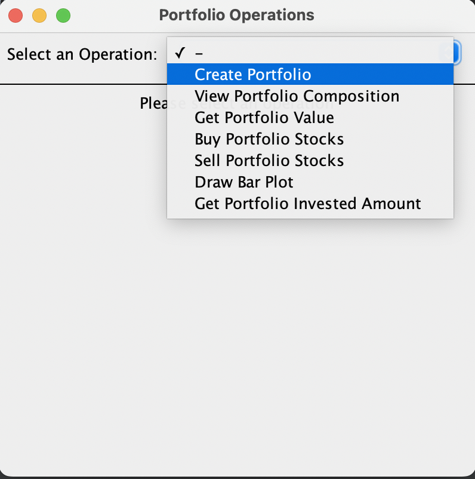
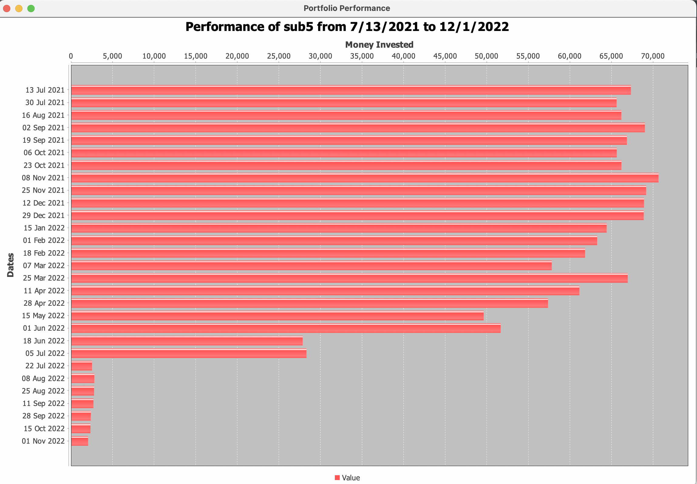

Portfolio
=========

------------------------------------------------------------------------

### Install and Run the Project

------------------------------------------------------------------------
    From the src folder of the project,
    cd <\project-root\>/res/
    java -jar Stock.jar
You will require a stable internet connection to run the project as 
it fetches stock values dynamically using the alpha-vintage API.
### How to Use the Project
#### Console based UI
Enter the type of view that you want to interact with:
    
    1. Text UI
    2. GUI
    Enter the operation: 

Enter 1 for console based UI:

    1. Text UI
    2. GUI
    Enter the operation: 1

Enter the name of the user in the below prompt and press enter

    1. Enter Username ?
    2. Exit
    Enter the number of operation:

Upon selecting any other option except 1 / 2, output:

    [ERROR]: Value must be either 1 or 2!
    Enter the number of the operation:

Upon selecting 2:

    Exiting from the portfolio app!
    Bye Bye

Upon Selecting 1: Expected Output

    Please Enter username:

Upon entering a valid username:

    Please Enter username: John
    Hello, John
    Please select one of Portfolio Types: 
    1. Flexible
    2. UnFlexibile
    3. Exit
    Enter Portfolio type:
If left empty:

    [ERROR]: Username cannot be empty!
    Please Enter username:
------------------------------------------------------------------------
Select the type of portfolio you want to interact with:
Select 2 to interact with inflexible portfolio.
    
    Enter Portfolio type: 2
    Operations that can be performed:
    1. Create Portfolio
    2. View Portfolio Composition
    3. Get Portfolio Value
    4. Exit
    Enter the number of the operation:

If invalid number is entered:

    Please select one of Portfolio Types:
    1. Flexible
    2. UnFlexibile
    3. Exit
    Enter Portfolio type: 4
    [ERROR]: Value entered is out of the specified numbers!
    Enter Portfolio type:

## Inflexible Portfolio

Enter the operation you want to perform from the list of operations
displayed.

### Portfolio 1 creation (3 stocks) {#portfolio-1-creation-3-stocks-}

Proceeding with first operation To create a portfolio, enter 1 in the
prompt

    Operations that can be performed:
    1. Create Portfolio
    2. View Portfolio Composition
    3. Get Portfolio Value
    4. Back
    Enter the number of the operation: 1
    Enter the name of portfolio:

On prompted to enter the name of portfolio, enter a name for the
portfolio to be created. If the portfolio is already created earlier, it
throws following error message:

    Enter the name of portfolio: Portfolio1
    [ERROR]: Portfolio already exists!

If a new portfolio name is entered, you are prompted to enter the name
of your stock:

    Enter the name of portfolio: Portfolio123
    Stock 1 Ticker:

Enter a valid Ticker name for your portfolio. If the name does not
exist, it will prompt you to enter the correct name.

    Stock 1 Ticker: COO

Input the number of the stocks required

    Stock 1 Count: 18

If you want to add more stocks to your portfolio, input 1, otherwise
input 2 to create a portfolio of the stocks entered so far.

    1. Add Stock ?
    2. Create Portfolio with current stocks ?
    Enter the number of the operation: 1
    Stock 2 Ticker: GOOGL
    Stock 2 Count: 35
    1. Add Stock ?
    2. Create Portfolio with current stocks ?
    Enter the number of the operation: 2

Enter 1 to add another stock and input the Stock Ticker and count when
prompted.

    Enter the number of the operation: 1
    Stock 3 Ticker: TSLA
    Stock 3 Count: 65
    1. Add Stock ?
    2. Create Portfolio with current stocks ?

Select 2 to create the portfolio of the entered stocks

    Enter the number of the operation: 2
    Portfolio Successfully Created!

### Portfolio 2 creation (2 stocks) {#portfolio-2-creation-2-stocks-}

Select 1 to create another portfolio

    Operations that can be performed:
    1. Create Portfolio
    2. View Portfolio Composition
    3. Get Portfolio Value
    4. Back
    Enter the number of the operation: 1

Input the name of the portfolio

    Enter the name of portfolio: Portfolio2

Enter a valid Ticker name for your portfolio. If the name does not
exist, it will prompt you to enter the correct name.

    Stock 1 Ticker: DRI

Input the number of the stocks required

    Stock 1 Count: 35

If you want to add more stocks to your portfolio, input 1, otherwise
input 2 to create a portfolio of the stocks entered so far.

    1. Add Stock ?
    2. Create Portfolio with current stocks ?
    Enter the number of the operation: 1
    Stock 2 Ticker: EQIX
    Stock 2 Count: 22
    1. Add Stock ?
    2. Create Portfolio with current stocks ?
    Enter the number of the operation: 2

Select 2 to create the portfolio of the entered stocks

    Enter the number of the operation: 2
    Portfolio Successfully Created!

### Porfolio Composition View

To view the Composition of the portfolio that you have created, input 2

    Operations that can be performed:
    1. Create Portfolio
    2. View Portfolio Composition
    3. Get Portfolio Value
    4. Back
    Enter the number of the operation: 2

Enter the name of the portfolio who\'s composition you want to view

    Enter the number of the operation: 2
    Enter the name of portfolio: Portfolio123

Expected Output

    Composition of Portfolio:
    Stocks    |    Stock Counts
    COO    |    18
    TSLA    |    65
    FANG    |    35

### Porfolio Value on a date

To find the value of the portfolio on a date, select option 3.

    Operations that can be performed:
    1. Create Portfolio
    2. View Portfolio Composition
    3. Get Portfolio Value
    4. Back
    Enter the number of the operation:3

Enter the name of the portfolio who\'s value you want to retrieve.

    Enter the name of portfolio: Portfolio123

Enter the date at which you want to retrieve the value of your
portfolio. The date cannot be greater than 11/01/2022.

    Enter the date in mm/dd/yyyy: 10/21/2022
    Portfolio Portfolio1 value: $23949.6202392578

### Back

Select option 4 to go back to the main menu

    Operations that can be performed:
    1. Create Portfolio
    2. View Portfolio Composition
    3. Get Portfolio Value
    4. Back
    Enter the number of the operation: 4
    Please select one of Portfolio Types:
    1. Flexible
    2. UnFlexibile
    3. Exit
    Enter Portfolio type: 

-----------------------------------------------------------------------------------------------------
## Flexible Portfolio
Select the type of portfolio you want to interact with:
Select 1 to interact with flexible portfolio.

    Enter Portfolio type: 1
    Operations that can be performed:
    1. Create Portfolio
    2. View Portfolio Composition
    3. Get Portfolio Value
    4. Buy Portfolio Stocks
    5. Sell Portfolio Stocks
    6. Draw Bar Plot
    7. Get Portfolio Invested Amount
    8. Back

    Enter the number of the operation:

Enter the operation you want to perform from the list of operations
displayed.

### Portfolio creation 

Proceeding with first operation To create a portfolio, enter 1 in the
prompt

    Operations that can be performed:
    1. Create Portfolio
    2. View Portfolio Composition
    3. Get Portfolio Value
    4. Buy Portfolio Stocks
    5. Sell Portfolio Stocks
    6. Draw Bar Plot
    7. Get Portfolio Invested Amount
    8. Back
    Enter the number of the operation: 1
    Enter the name of portfolio:

On prompted to enter the name of portfolio, enter a name for the
portfolio to be created. If the portfolio is already created earlier, it
throws following error message:

    Enter the name of portfolio: Portfolio3
    [ERROR]: Portfolio already exists!

If a new portfolio name is entered, you are prompted to select the type of portfolio to
be created.

     1. Fixed Value Strategy
     2. Dollar Cost Averaging
     3. Buy Stock shares
     Enter the strategy type:

Select 3 to buy shares normally and enter the date for the creation of the portfolio:

    Enter the strategy type: 3
    Enter the date in mm/dd/yyyy: 11/17/2022

Enter the name of your stock:

    Stock 1 Ticker:

Enter a valid Ticker name for your portfolio. If the name does not
exist, it will prompt you to enter the correct name.

    Stock 1 Ticker: COO

Input the number of the stocks required

    Stock 1 Count: 18
Input the commission for the transaction

    Commission Fee for transaction (in $): 10

If you want to add more stocks to your portfolio, input 1, otherwise
Select 2 to create the portfolio of the entered stocks

    1. Add Stock ?
    2. Create Portfolio with current stocks ?
    Enter the number of the operation: 2
    Portfolio Successfully Created!

### Strategy Stocks
To create a portfolio of fixed amount strategy, select option

    1. Fixed Value Strategy
    2. Dollar Cost Averaging
    3. Buy Stock shares
    Enter the strategy type: 1

Enter the total amount of money to be invested in the strategy, commission fee for the 
transaction and date of creation of the portfolio

    Enter the total money (in $): 1000
    Enter the commission fee (in $): 12
    Enter Date (in MM/DD/YYYY format): 11/30/2022

Enter the name of the stocks and the percentage of total amount to be invested in the strategy

    Stock 1 Ticker: googl
    Enter the Stock Percentage: 30
    Stock 2 Ticker: aapl
    Enter the Stock Percentage: 70
    Portfolio Successfully Created!

Enter 2 to create a dollar cost averaging portfolio\

    1. Fixed Value Strategy
    2. Dollar Cost Averaging
    3. Buy Stock shares
    Enter the strategy type: 2

Enter the toatl amount of money to be invested in the strategy, the commission fee for 
the transaction, the start date of the strategy, end date of the strategy and the recurring
period after which the strategy needs to be reinvested.

    Enter the total money (in $): 1000
    Enter the commission fee (in $): 12
    Enter Start Date (in MM/DD/YYYY format): 11/30/2022
    Enter end Date (in MM/DD/YYYY format): 11/30/2023
    Enter the recurring period (in days): 30

Enter the name of the stocks and the percentage of total amount to be invested in the strategy

    Stock 1 Ticker: googl
    Enter the Stock Percentage: 30
    Stock 2 Ticker: aapl
    Enter the Stock Percentage: 70
    Portfolio Successfully Created!

### Buy Stocks

Select 4 to add more stocks to a portfolio.

    `Operations that can be performed:
    1. Create Portfolio
    2. View Portfolio Composition
    3. Get Portfolio Value
    4. Buy Portfolio Stocks
    5. Sell Portfolio Stocks
    6. Draw Bar Plot
    7. Get Portfolio Invested Amount
    8. Back
    Enter the number of the operation: 4

Enter the Portfolio name:

    Enter the number of the operation: 4
    Enter the name of portfolio: Portfolio5

Enter 3 to buy the normal type of stocks to portfolio without a strategy

    1. Fixed Value Strategy
    2. Dollar Cost Averaging
    3. Buy Stock shares
    Enter the strategy type: 3

Enter the name of the stock and the count of the stock

    `Enter the Stock Ticker: aapl
    Enter the Stock Count: 10`

Enter the date on which the stock needs to be created

    `Enter the date in mm/dd/yyyy: 08/15/2022`

Enter the commission fee for the transaction:

    `Commission Fee for transaction (in $): 15`

It throws an error message as we can't buy a stock on a date that is prior to portfolio creation

    `[ERROR]:  Portfolio portfolio5 does not exist for the user John on date 08/15/2002`

Let us try adding stocks to a portfolio3 that was created on 01/03/2022 with a stock COO already existing.

    `Operations that can be performed:
    1. Create Portfolio
    2. View Portfolio Composition
    3. Get Portfolio Value
    4. Buy Portfolio Stocks
    5. Sell Portfolio Stocks
    6. Draw Bar Plot
    7. Get Portfolio Invested Amount
    8. Back
    Enter the number of the operation: 4
    Enter the name of portfolio: Portfolio5`

Enter the name of the stock and the count of the stock

    `Enter the Stock Ticker: aapl
    Enter the Stock Count: 10`

Enter the date on which the stock needs to be created

    `Enter the date in mm/dd/yyyy: 08/15/2022`

Enter the commission fee for the transaction:

    `Commission Fee for transaction (in $): 15
    Stock Successfully Bought to the Portfolio!`

Enter 4 to add more stocks to the portfolio and select similar options:

    Operations that can be performed:
    1. Create Portfolio
    2. View Portfolio Composition
    3. Get Portfolio Value
    4. Buy Portfolio Stocks
    5. Sell Portfolio Stocks
    6. Draw Bar Plot
    7. Get Portfolio Invested Amount
    8. Back
    Enter the number of the operation: 4
    Enter the name of portfolio: Portfolio3
    Enter the Stock Ticker: tsla
    Enter the Stock Count: 5
    Enter the date in mm/dd/yyyy: 04/22/2022
    Commission Fee for transaction (in $): 8
    Stock Successfully Bought to the Portfolio!

    Operations that can be performed:
    1. Create Portfolio
    2. View Portfolio Composition
    3. Get Portfolio Value
    4. Buy Portfolio Stocks
    5. Sell Portfolio Stocks
    6. Draw Bar Plot
    7. Get Portfolio Invested Amount
    8. Back
    Enter the number of the operation: 4
    Enter the name of portfolio: Portfolio3
    Enter the Stock Ticker: googl
    Enter the Stock Count: 15

If you enter a future date. An error message is thrown

    `Enter the date in mm/dd/yyyy: 12/12/2022
    [ERROR]: Date cannot be in future!
    Enter the date in mm/dd/yyyy: 11/16/2022
    Commission Fee for transaction (in $): 19
    Stock Successfully Bought to the Portfolio!`

Enter 1 to buy stocks as a fixed strategy portfolio

    1. Fixed Value Strategy
    2. Dollar Cost Averaging
    3. Buy Stock shares
    Enter the strategy type: 1

Enter the total amount of money to be invested in the strategy, commission fee for the
transaction and date of creation of the portfolio

    Enter the total money (in $): 1000
    Enter the commission fee (in $): 12
    Enter Date (in MM/DD/YYYY format): 11/30/2022

Enter the name of the stocks and the percentage of total amount to be invested in the strategy

    Stock 1 Ticker: googl
    Enter the Stock Percentage: 30
    Stock 2 Ticker: aapl
    Enter the Stock Percentage: 70
    Stock Successfully Bought to the Portfolio!

Enter 2 to create a dollar cost averaging portfolio\

    1. Fixed Value Strategy
    2. Dollar Cost Averaging
    3. Buy Stock shares
    Enter the strategy type: 2

Enter the toatl amount of money to be invested in the strategy, the commission fee for
the transaction, the start date of the strategy, end date of the strategy and the recurring
period after which the strategy needs to be reinvested.

    Enter the total money (in $): 1000
    Enter the commission fee (in $): 12
    Enter Start Date (in MM/DD/YYYY format): 11/30/2022
    Enter end Date (in MM/DD/YYYY format): 11/30/2023
    Enter the recurring period (in days): 30

Enter the name of the stocks and the percentage of total amount to be invested in the strategy

    Stock 1 Ticker: googl
    Enter the Stock Percentage: 30
    Stock 2 Ticker: aapl
    Enter the Stock Percentage: 70
    Portfolio Successfully Created!

### Value of Portfolio

Enter 3 to get the value of a Portfolio on a given date

    `Operations that can be performed:
    1. Create Portfolio
    2. View Portfolio Composition
    3. Get Portfolio Value
    4. Buy Portfolio Stocks
    5. Sell Portfolio Stocks
    6. Draw Bar Plot
    7. Get Portfolio Invested Amount
    8. Back
    Enter the number of the operation: 3
    Enter the name of portfolio: `

Enter the name of the portfolio and the date on which the value of portfolio needs to be fetched
    
    `Enter the name of portfolio: Portfolio3    
    Enter the date in mm/dd/yyyy: 11/16/2022`

The value of the portfolio gets displayed:

   ` Portfolio Portfolio3 value: $9491.5500000000`

Enter 3 to get the value of a Portfolio on a given date
Enter the name of the portfolio and the date on which the value of portfolio needs to be fetched

    `Operations that can be performed:
    1. Create Portfolio
    2. View Portfolio Composition
    3. Get Portfolio Value
    4. Buy Portfolio Stocks
    5. Sell Portfolio Stocks
    6. Draw Bar Plot
    7. Get Portfolio Invested Amount
    8. Back
    Enter the number of the operation: 3
    Enter the name of portfolio: Portfolio3
    Enter the date in mm/dd/yyyy: 7/14/2022
    Portfolio Portfolio3 value: $8767.7000000000`

If the value of the portfolio is requested before it's date of creation, 0 is returned

    `Operations that can be performed:
    1. Create Portfolio
    2. View Portfolio Composition
    3. Get Portfolio Value
    4. Buy Portfolio Stocks
    5. Sell Portfolio Stocks
    6. Draw Bar Plot
    7. Get Portfolio Invested Amount
    8. Back
    Enter the number of the operation: 3
    Enter the name of portfolio: Portfolio3
    Enter the date in mm/dd/yyyy: 01/01/2019
    Portfolio Portfolio3 value: $0.0000000000`

### Cost basis of a portfolio - amount of money invested in a portfolio

Select 7 to get the total amount of money invested in a portfolio until a given date

    `Operations that can be performed:
    1. Create Portfolio
    2. View Portfolio Composition
    3. Get Portfolio Value
    4. Buy Portfolio Stocks
    5. Sell Portfolio Stocks
    6. Draw Bar Plot
    7. Get Portfolio Invested Amount
    8. Back
    Enter the number of the operation: 7`

Enter the name of the portfolio and date at which you need to retrieve the amount invested

    `Enter the number of the operation: 7
    Enter the name of portfolio: portfolio3
    Enter the date in mm/dd/yyyy: 11/16/2022
    Total invested amount in portfolio portfolio3 till date 11/16/2022 is $15880.700000`

Follow similar steps to get the amount invested value on a different date

    Operations that can be performed:
    1. Create Portfolio
    2. View Portfolio Composition
    3. Get Portfolio Value
    4. Buy Portfolio Stocks
    5. Sell Portfolio Stocks
    6. Draw Bar Plot
    7. Get Portfolio Invested Amount
    8. Back
    Enter the number of the operation: 7
    Enter the name of portfolio: portfolio3
    Enter the date in mm/dd/yyyy: 7/14/2022
    Total invested amount in portfolio portfolio3 till date 07/14/2022 is $12632.050000

### Composition of a portfolio

Select 2 to view the composition of a portfolio on a given date

    Operations that can be performed:
    1. Create Portfolio
    2. View Portfolio Composition
    3. Get Portfolio Value
    4. Buy Portfolio Stocks
    5. Sell Portfolio Stocks
    6. Draw Bar Plot
    7. Get Portfolio Invested Amount
    8. Back
    Enter the number of the operation: 2 

Enter the name of the portfolio and the date at which you want to view the composition of the portfolio

    Enter the name of portfolio: portfolio3
    Enter the date in mm/dd/yyyy: 11/16/2022

This will display the composition of portfolio on the given date

    `Composition of Portfolio:
    Stocks	|	Stock Counts
    aapl	|	10
    COO	|	18
    tsla	|	5
    googl	|	15`

Select 2 to view the composition of portfolio on another date

    Operations that can be performed:
    1. Create Portfolio
    2. View Portfolio Composition
    3. Get Portfolio Value
    4. Buy Portfolio Stocks
    5. Sell Portfolio Stocks
    6. Draw Bar Plot
    7. Get Portfolio Invested Amount
    8. Back
    Enter the number of the operation: 2 
    Enter the name of portfolio: portfolio3
    Enter the date in mm/dd/yyyy: 7/16/2022
    Composition of Portfolio:
    Stocks	|	Stock Counts
    COO	|	18
    tsla	|	5

### Sell stocks

You can select 5 to delete stocks from an existing portfolio

    Operations that can be performed:
    1. Create Portfolio
    2. View Portfolio Composition
    3. Get Portfolio Value
    4. Buy Portfolio Stocks
    5. Sell Portfolio Stocks
    6. Draw Bar Plot
    7. Get Portfolio Invested Amount
    8. Back
    Enter the number of the operation: 5

This will prompt you to enter the name of the portfolio, the name of the stock and the number of stocks 
you want to sell

    Enter the name of portfolio: portfolio3
    Enter the Stock Ticker: aapl
    Enter the Stock Count: 10
    Enter the date in mm/dd/yyyy: 04/21/2022
    Commission Fee for transaction (in $): 20

When the date provided is prior ot date of creation of the stock, an error message is thrown

    [ERROR]:  Given shares 10 of the Stock aapl are not present on the date 04/21/2022 in the portfolio portfolio3

When the count of stocks in greater than the stocks that exist, it throws an error:

    Enter the name of portfolio: portfolio3
    Enter the Stock Ticker: aapl
    Enter the Stock Count: 20
    Enter the date in mm/dd/yyyy: 09/15/2022
    Commission Fee for transaction (in $): 20
    [ERROR]:  Given shares 20 of the Stock aapl are not present on the date 09/15/2022 in the portfolio portfolio3

When you enter the correct date and count of stocks, the stock gets deleted successfully

    Enter the Stock Count: 10
    Enter the date in mm/dd/yyyy: 9/21/2022
    Commission Fee for transaction (in $): 15
    Stock Successfully removed from the Portfolio!

Check the composition of the portfolio to see if the stock is deleted

    Operations that can be performed:
    1. Create Portfolio
    2. View Portfolio Composition
    3. Get Portfolio Value
    4. Buy Portfolio Stocks
    5. Sell Portfolio Stocks
    6. Draw Bar Plot
    7. Get Portfolio Invested Amount
    8. Back
    Enter the number of the operation: 2
    Enter the name of portfolio: portfolio3
    Enter the date in mm/dd/yyyy: 11/16/2022
    Composition of Portfolio:
    Stocks	|	Stock Counts
    aapl	|	0
    COO	|	18
    tsla	|	5
    googl	|	15

You can even delete only a few count of stocks from a portfolio instead of all the stocks

    Operations that can be performed:
    1. Create Portfolio
    2. View Portfolio Composition
    3. Get Portfolio Value
    4. Buy Portfolio Stocks
    5. Sell Portfolio Stocks
    6. Draw Bar Plot
    7. Get Portfolio Invested Amount
    8. Back
    Enter the number of the operation: 5
    Enter the name of portfolio: portfolio3
    Enter the Stock Ticker: tsla
    Enter the Stock Count: 3
    Enter the date in mm/dd/yyyy: 11/01/2022
    Commission Fee for transaction (in $): 20
    Stock Successfully removed from the Portfolio!

Now, view the composition as follows to check if the stocks have been deleted
as expected.

    Operations that can be performed:
    1. Create Portfolio
    2. View Portfolio Composition
    3. Get Portfolio Value
    4. Buy Portfolio Stocks
    5. Sell Portfolio Stocks
    6. Draw Bar Plot
    7. Get Portfolio Invested Amount
    8. Back
    Enter the number of the operation: 2
    Enter the name of portfolio: portfolio3
    Enter the date in mm/dd/yyyy: 11/16/2022
    Composition of Portfolio:
    Stocks	|	Stock Counts
    aapl	|	0
    COO	|	18
    tsla	|	2
    googl	|	15

### Performance Graph
Select option 6 to view the performance graph

    Operations that can be performed:
    1. Create Portfolio
    2. View Portfolio Composition
    3. Get Portfolio Value
    4. Buy Portfolio Stocks
    5. Sell Portfolio Stocks
    6. Draw Bar Plot
    7. Get Portfolio Invested Amount
    8. Back
    Enter the number of the operation: 6

Enter the portfolio name and the start data and end date for which
the performance needs to be viewed. The dates should be in the MM/YYYY 
format.

    Enter the name of portfolio: portfolio3
    Enter the start date (MM/YYYY format): 02/2022
    Enter the End date (MM/YYYY format): 11/2022

The graph will be displayed as follows

    Performance of portfolio3 from Feb 2022 to Nov 2022
    02/01/2022 : ***************************
    02/11/2022 : ***************************
    02/22/2022 : ***************************
    03/04/2022 : *****************************
    03/14/2022 : **************************
    03/24/2022 : *****************************
    04/04/2022 : *****************************
    04/14/2022 : ****************************
    04/25/2022 : ***********************************************
    05/05/2022 : *****************************************
    05/16/2022 : *************************************
    05/26/2022 : **************************************
    06/06/2022 : **************************************
    06/16/2022 : *********************************
    06/27/2022 : *************************************
    07/07/2022 : ************************************
    07/18/2022 : **********************************
    07/28/2022 : ***************************************
    08/08/2022 : ****************************************
    08/18/2022 : ***********************************************
    08/29/2022 : ********************************
    09/08/2022 : *********************************
    09/19/2022 : ********************************
    09/29/2022 : ************************
    10/10/2022 : **********************
    10/20/2022 : **********************
    10/31/2022 : ***********************
    11/10/2022 : **********************
    Scale: * = $255

### Back

Select option 4 to go back to the main menu

    Operations that can be performed:
    1. Create Portfolio
    2. View Portfolio Composition
    3. Get Portfolio Value
    4. Back
    Enter the number of the operation: 4
    Please select one of Portfolio Types:
    1. Flexible
    2. UnFlexibile
    3. Exit
    Enter Portfolio type: 

### Exit
Select option 3 to quit the program

    Please select one of Portfolio Types:
    1. Flexible
    2. UnFlexibile
    3. Exit
    Enter Portfolio type: 3
    Exiting from the portfolio app!
    Bye Bye John

#### GUI

Enter 2 to select GUI based UI:
    
    Select the UI:
    1. Text UI
    2. GUI
    Enter the operation: 2

Enter username:

Select the operation you want to  perform from the drop down menu as required

On selecting create Portfolio, you can select the type of portfolio to be created.

Select a type of portfolio. To buy stocks normally, select buy stock shares. To invest in 
fixed value strategy, select "Fixed Value Strategy". To invest in dollar cost averaging strategy,
select "Dollar Cost Averaging Strategy". Upon selection, the below prompt is displayed.

You can set the date of creation of portfolio. The stocks and percentage of total amount to be invested in
each stock. Click on Add Stocks button to add more stocks. Click on create Portfolio buttion
to create a portfolio from entered stocks.

To view portfolio composition select the Portfolio Composition

To view portfolio value select the Portfolio Value

To view the amount of money invested in the portfolio select the "get portfolio amount invested"

To view the portfolio performance, select Draw bar graph and enter the time period.

To add more stocks to the portfolio, select Buy Portfolio Stocks

To add more stocks to the portfolio, select Sell Portfolio Stocks

### Valid Stock Symbols: {#valid-stock-symbols-}

*Old*

    MMM
    AOS
    ABT
    ABBV
    ABMD
    ACN
    ATVI
    ADM
    ADBE
    ADP
    AAP
    AES
    AFL
    A
    APD
    AKAM
    ALK
    ALB
    ARE
    ALGN
    ALLE
    LNT
    ALL
    GOOGL
    GOOG
    MO
    AMZN
    AMCR
    AMD
    AEE
    AAL
    AEP
    AXP
    AIG
    AMT
    AWK
    AMP
    ABC
    AME
    AMGN
    APH
    ADI
    ANSS
    AON
    APA
    AAPL
    AMAT
    APTV
    ANET
    AJG
    AIZ
    T
    ATO
    ADSK
    AZO
    AVB
    AVY
    BKR
    BALL
    BAC
    BBWI
    BAX
    BDX
    WRB
    BRK.B
    BBY
    BIO
    TECH
    BIIB
    BLK
    BK
    BA
    BKNG
    BWA
    BXP
    BSX
    BMY
    AVGO
    BR
    BRO
    BF.B
    CHRW
    CDNS
    CZR
    CPT
    CPB
    COF
    CAH
    KMX
    CCL
    CARR
    CTLT
    CAT
    CBOE
    CBRE
    CDW
    CE
    CNC
    CNP
    CDAY
    CF
    CRL
    SCHW
    CHTR
    CVX
    CMG
    CB
    CHD
    CI
    CINF
    CTAS
    CSCO
    C
    CFG
    CLX
    CME
    CMS
    KO
    CTSH
    CL
    CMCSA
    CMA
    CAG
    COP
    ED
    STZ
    CEG
    COO
    CPRT
    GLW
    CTVA
    CSGP
    COST
    CTRA
    CCI
    CSX
    CMI
    CVS
    DHI
    DHR
    DRI
    DVA
    DE
    DAL
    XRAY
    DVN
    DXCM
    FANG
    DLR
    DFS
    DISH
    DIS
    DG
    DLTR
    D
    DPZ
    DOV
    DOW
    DTE
    DUK
    DD
    DXC
    EMN
    ETN
    EBAY
    ECL
    EIX
    EW
    EA
    ELV
    LLY
    EMR
    ENPH
    ETR
    EOG
    EPAM
    EQT
    EFX
    EQIX
    EQR
    ESS
    EL
    ETSY
    RE
    EVRG
    ES
    EXC
    EXPE
    EXPD
    EXR
    XOM
    FFIV
    FDS
    FAST
    FRT
    FDX
    FITB
    FRC
    FE
    FIS
    FISV
    FLT
    FMC
    F
    FTNT
    FTV
    FBHS
    FOXA
    FOX
    BEN
    FCX
    GRMN
    IT
    GNRC
    GD
    GE
    GIS
    GM
    GPC
    GILD
    GL
    GPN
    GS
    HAL
    HIG
    HAS
    HCA
    PEAK
    HSIC
    HSY
    HES
    HPE
    HLT
    HOLX
    HD
    HON
    HRL
    HST
    HWM
    HPQ
    HUM
    HBAN
    HII
    IBM
    IEX
    IDXX
    ITW
    ILMN
    INCY
    IR
    INTC
    ICE
    IP
    IPG
    IFF
    INTU
    ISRG
    IVZ
    INVH
    IQV
    IRM
    JBHT
    JKHY
    J
    JNJ
    JCI
    JPM
    JNPR
    K
    KDP
    KEY
    KEYS
    KMB
    KIM
    KMI
    KLAC
    KHC
    KR
    LHX
    LH
    LRCX
    LW
    LVS
    LDOS
    LEN
    LNC
    LIN
    LYV
    LKQ
    LMT
    L
    LOW
    LUMN
    LYB
    MTB
    MRO
    MPC
    MKTX
    MAR
    MMC
    MLM
    MAS
    MA
    MTCH
    MKC
    MCD
    MCK
    MDT
    MRK
    META
    MET
    MTD
    MGM
    MCHP
    MU
    MSFT
    MAA
    MRNA
    MHK
    MOH
    TAP
    MDLZ
    MPWR
    MNST
    MCO
    MS
    MOS
    MSI
    MSCI
    NDAQ
    NTAP
    NFLX
    NWL
    NEM
    NWSA
    NWS
    NEE
    NKE
    NI
    NDSN
    NSC
    NTRS
    NOC
    NLOK
    NCLH
    NRG
    NUE
    NVDA
    NVR
    NXPI
    ORLY
    OXY
    ODFL
    OMC
    ON
    OKE
    ORCL
    OGN
    OTIS
    PCAR
    PKG
    PARA
    PH
    PAYX
    PAYC
    PYPL
    PNR
    PEP
    PKI
    PFE
    PCG
    PM
    PSX
    PNW
    PXD
    PNC
    POOL
    PPG
    PPL
    PFG
    PG
    PGR
    PLD
    PRU
    PEG
    PTC
    PSA
    PHM
    QRVO
    PWR
    QCOM
    DGX
    RL
    RJF
    RTX
    O
    REG
    REGN
    RF
    RSG
    RMD
    RHI
    ROK
    ROL
    ROP
    ROST
    RCL
    SPGI
    CRM
    SBAC
    SLB
    STX
    SEE
    SRE
    NOW
    SHW
    SBNY
    SPG
    SWKS
    SJM
    SNA
    SEDG
    SO
    LUV
    SWK
    SBUX
    STT
    STE
    SYK
    SIVB
    SYF
    SNPS
    SYY
    TMUS
    TROW
    TTWO
    TPR
    TRGP
    TGT
    TEL
    TDY
    TFX
    TER
    TSLA
    TXN
    TXT
    TMO
    TJX
    TSCO
    TT
    TDG
    TRV
    TRMB
    TFC
    TYL
    TSN
    USB
    UDR
    ULTA
    UNP
    UAL
    UPS
    URI
    UNH
    UHS
    VLO
    VTR
    VRSN
    VRSK
    VZ
    VRTX
    VFC
    VTRS
    VICI
    V
    VNO
    VMC
    WAB
    WBA
    WMT
    WBD
    WM
    WAT
    WEC
    WFC
    WELL
    WST
    WDC
    WRK
    WY
    WHR
    WMB
    WTW
    GWW
    WYNN
    XEL
    XYL
    YUM
    ZBRA
    ZBH
    ZION
    ZTS

*New* \
All the stocks supported by the alpha vintage API

### Date Range of Stocks: {#date-range-of-stocks-}

*old*\
Past 250 days stock values from 11/02/2022 has been stored. This data is
fetched from the Yahoo Finance API.

***Note: The stock data might miss saturdays and sundays or any public
holidays on which the stocks Stock Exchange is closed. In case any value
missed, the app throws error saying stock value not available on that
specific date.***
